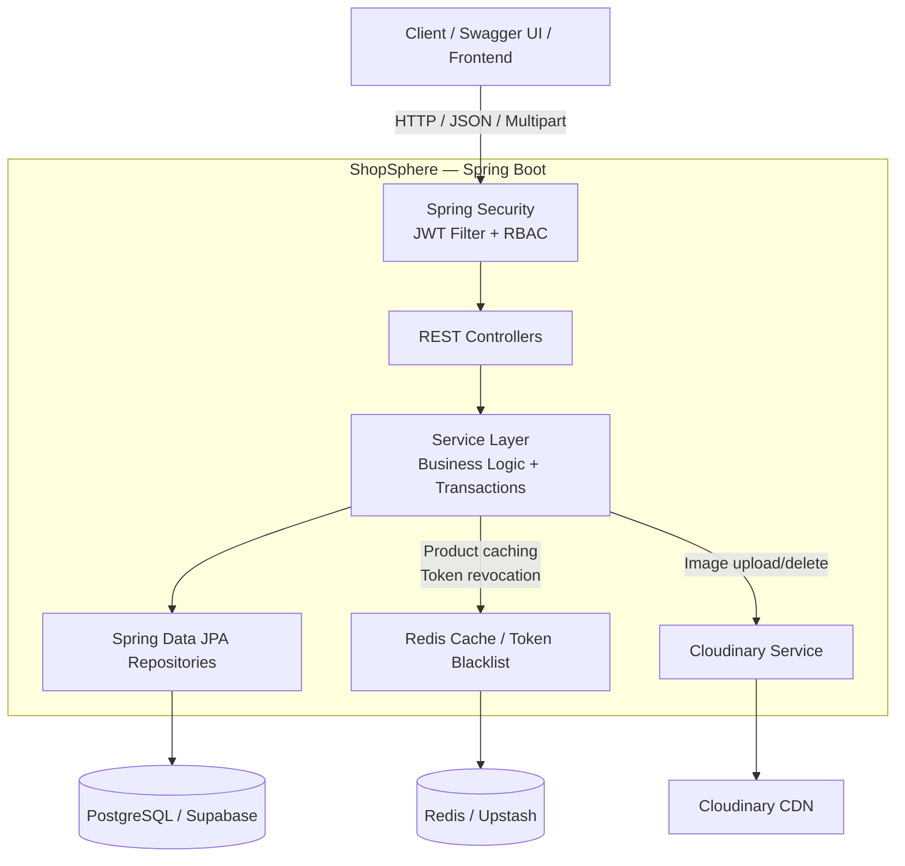
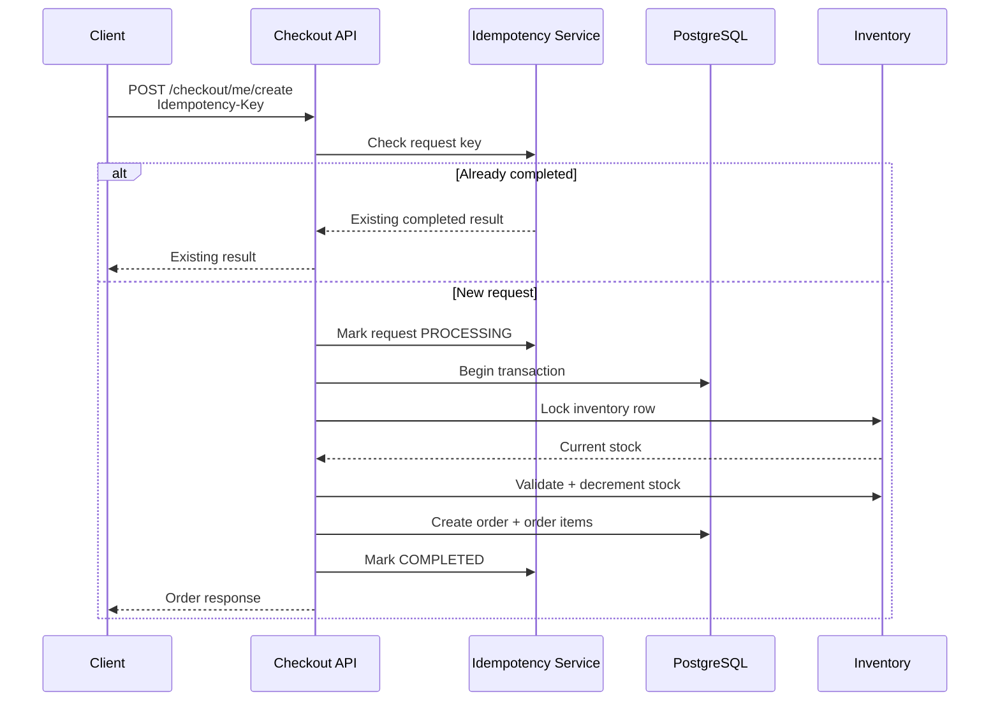

# ShopSphere — Production-Style E-Commerce Backend

> A secure, transaction-aware e-commerce REST API built with Java 21 and Spring Boot, with JWT authentication, role-based authorization, PostgreSQL persistence, Redis caching/token revocation, Cloudinary image storage, idempotent checkout, inventory concurrency controls, validation, automated tests, Docker support, and cloud deployment.

**Live API:** `https://shopsphere-1-m11u.onrender.com`  
**Swagger UI:** `https://shopsphere-1-m11u.onrender.com/swagger-ui/index.html`

---

## Why ShopSphere?

ShopSphere was built to go beyond basic CRUD and model several backend concerns that appear in real e-commerce systems:

- Authentication and authorization
- Transactional checkout
- Inventory consistency under concurrent requests
- Idempotency for retry-safe checkout operations
- Redis caching and JWT revocation
- Database indexing and dynamic filtering
- Centralized exception handling
- Automated unit and integration testing
- Dockerized local development
- Cloud deployment with managed PostgreSQL and Redis

The project is intentionally structured around **controllers → services → repositories → database/infrastructure**, keeping business logic out of controllers and separating infrastructure concerns from domain logic.

---

## Architecture



### Checkout / inventory consistency



---

## Core Features

### Authentication & Security

- User registration and login
- BCrypt password hashing
- Stateless JWT authentication
- JWT `jti` generation for token identification
- Redis-backed token blacklist for logout/revocation
- Role-based authorization:
  - `CUSTOMER`
  - `ADMIN`
- Protected user, cart, order, checkout, payment, inventory, and administrative endpoints
- Centralized `401 Unauthorized` and `403 Forbidden` responses
- CORS configuration
- Swagger/OpenAPI JWT Bearer authentication

### User & Address Management

- User profile retrieval and updates
- Password change
- Admin user management
- User-specific address management
- Multiple address support
- Default-address handling
- Address type support
- Address validation and business rules

### Product & Category Management

- Product CRUD
- Category CRUD
- Product/category relationships
- Product activation/deactivation
- Product search
- Category filtering
- Price-range filtering
- Pagination
- Sorting
- Dynamic filtering using JPA Specifications
- Database indexes for frequently queried product fields

### Product Images

- Multipart image upload
- Multiple images per product
- Image retrieval
- Individual image retrieval
- Image replacement
- Image deletion
- Cloudinary-backed image storage
- Cloudinary public IDs retained for deletion/replacement

### Cart & Checkout

- User-specific cart
- Add/update/remove cart items
- Cart total calculation
- Checkout from cart
- Product availability validation
- Transactional order creation
- Idempotency-key support for retry-safe checkout requests

### Orders & Payments

- Order creation and retrieval
- User order history
- Order status management
- Customer cancellation
- Admin order-status updates
- Payment creation
- Payment status handling
- Payment amount validation
- Duplicate payment protection
- Payment failure handling

### Inventory & Concurrency

- Inventory tracking
- Restocking
- Stock movement history
- Optimistic locking with JPA `@Version`
- Pessimistic row locking for critical inventory operations
- Transactional inventory updates
- Insufficient-stock handling

### Performance

- Redis caching for product reads
- Cache update/eviction on product mutations
- Redis-backed JWT blacklist
- PostgreSQL indexes
- Pagination instead of unbounded result sets
- Dynamic filtering through JPA Specifications
- HikariCP production pool tuning

### Validation & Error Handling

- Jakarta Bean Validation
- DTO-based request/response boundaries
- Custom domain exceptions
- Global exception handler
- Consistent error responses
- Invalid pagination/sorting/price-range handling
- Resource-not-found handling
- Business-rule exceptions for cart, checkout, inventory, order, and payment flows

---

## Technology Stack

| Layer | Technology |
|---|---|
| Language | Java 21 |
| Framework | Spring Boot 4.1 |
| Web | Spring MVC |
| Security | Spring Security |
| Authentication | JWT / JJWT |
| Password Hashing | BCrypt |
| Persistence | Spring Data JPA / Hibernate |
| Database | PostgreSQL |
| Database Hosting | Supabase |
| Caching / Revocation | Redis |
| Redis Hosting | Upstash |
| Image Storage | Cloudinary |
| API Documentation | OpenAPI / Swagger UI |
| Validation | Jakarta Bean Validation |
| Testing | JUnit / Spring Boot Test / Mockito |
| Load Testing | k6 |
| Containerization | Docker / Docker Compose |
| Build Tool | Maven |
| Deployment | Render |

---

## Backend Structure

```text
src/
├── main/
│   ├── java/com/wasil/ShopSphere/
│   │   ├── config/
│   │   │   ├── CloudinaryConfig.java
│   │   │   ├── OpenApiConfig.java
│   │   │   ├── RedisConfig.java
│   │   │   └── SecurityConfig.java
│   │   │
│   │   ├── controller/
│   │   │   ├── AddressController.java
│   │   │   ├── AuthController.java
│   │   │   ├── CartController.java
│   │   │   ├── CategoryController.java
│   │   │   ├── CheckoutController.java
│   │   │   ├── InventoryController.java
│   │   │   ├── OrderController.java
│   │   │   ├── PaymentController.java
│   │   │   ├── ProductController.java
│   │   │   └── UserController.java
│   │   │
│   │   ├── dto/
│   │   ├── exceptions/
│   │   ├── model/
│   │   ├── repositories/
│   │   ├── security/
│   │   ├── services/
│   │   └── specifications/
│   │
│   └── resources/
│       ├── application.properties
│       └── application-*.properties
│
└── test/
    ├── java/
    └── resources/
```

### Layer responsibilities

**Controllers**

Handle HTTP concerns, request mapping, DTO input/output, and validation boundaries.

**Services**

Contain business rules, transaction boundaries, caching behavior, checkout orchestration, inventory handling, and payment/order workflows.

**Repositories**

Provide database access through Spring Data JPA.

**DTOs**

Prevent persistence entities from becoming the API contract and provide request/response validation boundaries.

**Security**

Contains authentication, JWT creation/validation, user loading, request filtering, role handling, and token revocation.

**Specifications**

Build dynamic product filtering queries without hardcoding every possible filter combination.

---

## Important Design Decisions

### 1. JWT + Redis token blacklist

JWTs are stateless by design, which makes immediate logout/revocation difficult. ShopSphere assigns each token a unique `jti` and stores revoked token IDs in Redis with a TTL matching the remaining token lifetime.

```text
JWT
 └── jti
      ↓
Redis: jwt:blacklist:{jti}
      ↓
Logout → revoked
      ↓
Future request → rejected
```

### 2. Idempotent checkout

Checkout accepts an `Idempotency-Key`.

The request lifecycle is tracked with states such as:

```text
PROCESSING → COMPLETED
           ↘ FAILED
```

If a client retries the same operation with the same key, the backend can identify the existing operation instead of blindly creating another order.

### 3. Inventory concurrency control

The inventory entity uses JPA optimistic locking:

```java
@Version
private Long version;
```

The inventory repository also contains a pessimistic write-lock query for critical stock updates.

The intent is to protect stock-changing operations from concurrent modifications.

### 4. Redis caching

Frequently accessed product data is cached with Spring Cache:

```text
GET product
    ↓
Redis hit? ── yes → return cached ProductResponse
    │
    no
    ↓
PostgreSQL
    ↓
store in Redis
    ↓
return response
```

Product updates refresh the relevant cache entry and product deletion/deactivation evicts it.

### 5. Database indexing

Product queries have indexes on:

- `category_id`
- `prod_price`
- `prod_is_active`

These support common filtering and availability queries.

---

## API Overview

The API is documented interactively through Swagger UI.

### Authentication

```text
POST /auth/register
POST /auth/login
POST /auth/logout
```

### Users

```text
GET    /users/me
PUT    /users/me
PUT    /users/me/changePassword

GET    /users
GET    /users/{id}
POST   /users
PUT    /users/{id}
DELETE /users/{id}
```

### Products

```text
GET    /products
GET    /products/{id}
POST   /products
PUT    /products/{id}
DELETE /products/{id}

POST   /products/{id}/images
GET    /products/{id}/images
GET    /products/{id}/images/{imageId}
PUT    /products/{id}/images/{imageId}
DELETE /products/{id}/images/{imageId}
```

### Categories

```text
GET    /category
GET    /category/{id}
POST   /category
PUT    /category/{id}
DELETE /category/{id}
PUT    /category/{id}/status
```

### Cart

```text
POST   /cart/me
GET    /cart/me
PUT    /cart/me
PUT    /cart/me/items/{prodId}
DELETE /cart/me/items/{prodId}
```

### Checkout

```text
POST /checkout/me
POST /checkout/me/create
```

### Orders

```text
GET /orders
GET /orders/{id}
GET /orders/me
GET /orders/me/{id}

PUT /orders/me/{id}/cancel
PUT /orders/{id}/cancel
PUT /orders/{orderId}/status
```

### Inventory

```text
POST /inventory/restock
GET  /inventory/{id}
GET  /inventory/{id}/stocks
```

### Payments

```text
POST /payment/me/{orderId}
```

### Addresses

```text
POST   /users/me/address
GET    /users/me/address
GET    /users/me/address/{id}
PUT    /users/me/address/{id}
DELETE /users/me/address/{id}
```

> Authorization requirements vary by endpoint. Administrative operations require the `ADMIN` role; customer-specific resources require authentication.

---

## API Documentation

Swagger UI is available at:

`https://shopsphere-1-m11u.onrender.com/swagger-ui/index.html`

The OpenAPI configuration defines a JWT Bearer security scheme, allowing authenticated endpoints to be tested directly from Swagger.

### Authentication in Swagger

1. Call `POST /auth/login`.
2. Copy the returned JWT.
3. Click **Authorize**.
4. Enter the bearer token.
5. Execute protected endpoints.

---

## Testing

ShopSphere includes unit and integration tests covering authentication, users, products, categories, carts, checkout, inventory, orders, payments, idempotency, and token blacklisting.

The repository currently contains **13 test classes**, including:

- `AuthServiceTest`
- `UserServiceTest`
- `ProductServiceTest`
- `CategoryServiceTest`
- `CartServiceTest`
- `CartServiceIntegrationTest`
- `CheckoutServiceTest`
- `CheckoutServiceIntegrationTest`
- `InventoryServiceTest`
- `OrderServiceTest`
- `PaymentServiceTest`
- `IdempotencyServiceTest`
- `TokenBlacklistServiceTest`

### k6 load test — checkout API

A separate k6 benchmark exercised the checkout endpoint with:

- **50 virtual users**
- **30 seconds**
- **7,232 completed requests**
- **239.02 requests/second**
- **Average latency:** 208.01 ms
- **p95 latency:** 327.72 ms
- **0 failed HTTP requests**
- **0 responses with status 5xx**
- Threshold: `p(95) < 500 ms` — **passed**

These numbers are from a **local test run**, not a claim about production capacity. Hardware, database configuration, network conditions, dataset size, and deployment resources all affect real-world performance.

### Checkout concurrency test

A separate 50-VU checkout test produced:

- **50 checkout attempts**
- **11 HTTP 200 responses**
- **39 HTTP 4xx responses**

This test was used to exercise the checkout/inventory/idempotency path under concurrent requests.

> These results should not be presented as proof of a specific maximum user capacity or as proof that a particular locking strategy "supports X users." They are test observations from the included k6 run.

---

## Running Locally

### Prerequisites

- Java 21
- Maven
- Docker Desktop
- Docker Compose

### Start the complete local stack

The repository includes PostgreSQL, Redis, and the Spring Boot backend in `docker-compose.yml`.

Create a local `.env` file with your own values for:

```env
POSTGRES_DB=ShopSphere
POSTGRES_USER=postgres
POSTGRES_PASSWORD=your-password

JWT_SECRET=your-jwt-secret

CLOUDINARY_CLOUD_NAME=your-cloud-name
CLOUDINARY_API_KEY=your-api-key
CLOUDINARY_API_SECRET=your-api-secret
```

Then:

```bash
docker compose up -d --build
```

Check containers:

```bash
docker compose ps
```

Stop the stack:

```bash
docker compose down
```

The local Docker profile connects the backend to:

```text
PostgreSQL → postgres:5432
Redis      → redis:6379
```

---

## Configuration Profiles

ShopSphere separates environment-specific infrastructure configuration.

### Local Docker

```text
SPRING_PROFILES_ACTIVE=docker
```

Uses the Docker Compose PostgreSQL and Redis services.

### Production

```text
SPRING_PROFILES_ACTIVE=prod
```

Uses managed PostgreSQL and Redis services through environment variables.

Production secrets should never be committed to Git.

---

## Production Deployment

Current deployment architecture:

```text
GitHub
   │
   ▼
Render
   │
   ├──────────────► Supabase PostgreSQL
   │
   └──────────────► Upstash Redis
                         │
                         └── TLS
```

Production configuration is supplied through environment variables rather than committed credentials.

Typical production variables include:

```text
SPRING_PROFILES_ACTIVE
SPRING_DATASOURCE_URL
SPRING_DATASOURCE_USERNAME
SPRING_DATASOURCE_PASSWORD
SPRING_DATA_REDIS_HOST
SPRING_DATA_REDIS_PORT
SPRING_DATA_REDIS_PASSWORD
JWT_SECRET
CLOUDINARY_CLOUD_NAME
CLOUDINARY_API_KEY
CLOUDINARY_API_SECRET
```

The production datasource pool is intentionally kept small to remain compatible with the managed PostgreSQL pooler limits.

---

## Security Notes

Never commit:

- JWT secrets
- Database passwords
- Cloudinary API secrets
- Redis passwords/tokens
- `.env` files containing credentials
- Production access tokens

Use environment variables or a secrets manager for deployment credentials.

If credentials were ever committed to a public repository, rotate them before making the repository public.

---

## Error Handling

The application provides centralized error handling for common failures, including:

```text
400 Bad Request
401 Unauthorized
403 Forbidden
404 Not Found
409 Conflict
500 Internal Server Error
```

Domain-specific exceptions cover cases such as:

- Product not found
- Category not found
- User not found
- Insufficient stock
- Duplicate resource
- Invalid password
- Empty cart
- Invalid payment
- Duplicate payment
- Order cancellation rules
- Invalid pagination
- Invalid sorting
- Invalid price range
- Product/category inactive states

---

## What This Project Demonstrates

ShopSphere demonstrates practical backend engineering concepts beyond basic CRUD:

```text
REST API Design
      +
Spring Security / JWT
      +
RBAC
      +
Transactional Business Logic
      +
PostgreSQL / JPA
      +
Redis Caching
      +
Token Revocation
      +
Idempotency
      +
Inventory Concurrency
      +
Database Indexing
      +
Dynamic Querying
      +
Cloudinary
      +
Unit + Integration Testing
      +
k6 Load Testing
      +
Docker
      +
Cloud Deployment
```

---

## Future Improvements

Potential extensions, deliberately kept outside the current scope:

- Flyway/Liquibase database migrations
- Refresh-token rotation
- Asynchronous order events
- Kafka-based event processing
- Distributed tracing
- Observability with metrics/log aggregation
- Dedicated payment-provider integration
- CI/CD pipeline with automated deployment gates
- More comprehensive API contract tests

---

## Project Status

**Status:** Deployed and functional

Current focus areas:

- Secure REST API
- Transactional checkout
- Inventory consistency
- Idempotent operations
- Redis integration
- Automated testing
- Load testing
- Dockerized development
- Cloud deployment

---

## Author

**Wasil Khan**

Backend-focused Java developer building production-oriented systems with:

`Java` · `Spring Boot` · `Spring Security` · `PostgreSQL` · `Redis` · `Docker`

