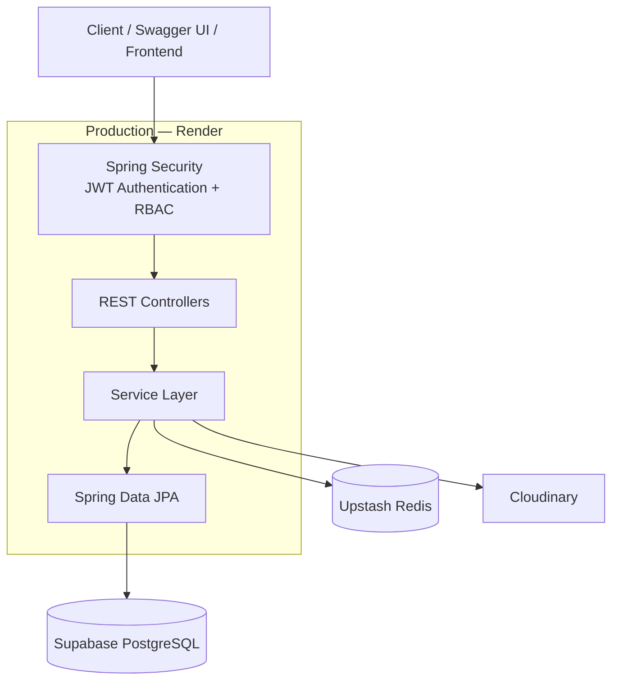
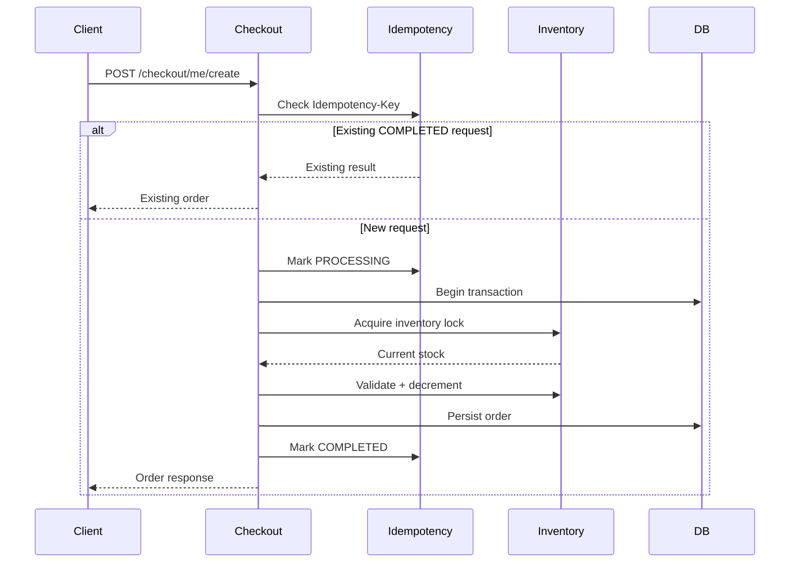

# ShopSphere Architecture

## High-Level Architecture



## Application Layers

```text
HTTP Request
     │
     ▼
┌───────────────────────────┐
│ Security Filter Chain     │
│ JWT Authentication        │
│ Role-Based Authorization  │
└─────────────┬─────────────┘
              ▼
┌───────────────────────────┐
│ Controllers               │
│ HTTP + DTO boundary       │
└─────────────┬─────────────┘
              ▼
┌───────────────────────────┐
│ Services                  │
│ Business logic            │
│ Transactions              │
│ Idempotency               │
│ Inventory coordination    │
└─────────────┬─────────────┘
              ▼
┌───────────────────────────┐
│ Repositories              │
│ Spring Data JPA           │
└─────────────┬─────────────┘
              ▼
       PostgreSQL
```

## Infrastructure

```text
                    ┌──────────────────┐
                    │      Render      │
                    │  Spring Boot API │
                    └───────┬──────────┘
                            │
              ┌─────────────┼─────────────┐
              │             │             │
              ▼             ▼             ▼
       ┌────────────┐ ┌────────────┐ ┌────────────┐
       │  Supabase  │ │   Upstash  │ │ Cloudinary │
       │ PostgreSQL │ │    Redis   │ │   Images   │
       └────────────┘ └────────────┘ └────────────┘
```

## Checkout Flow



## Product Read Path

```text
GET /products/{id}
       │
       ▼
ProductService
       │
       ▼
Redis cache?
   ┌───┴───┐
   │       │
  HIT     MISS
   │       │
   │       ▼
   │   PostgreSQL
   │       │
   │       ▼
   │     Redis
   │       │
   └───┬───┘
       ▼
ProductResponse
```

## JWT Revocation

```text
Login
  │
  ▼
JWT generated
  │
  └── jti = unique token ID

Logout
  │
  ▼
Redis
jwt:blacklist:{jti}
  │
  ▼
Future request
  │
  ▼
JwtAuthenticationFilter
  │
  ├── token valid?
  ├── user enabled?
  └── jti blacklisted?
        │
        ├── yes → reject
        └── no  → authenticate
```

## Data Consistency

### Optimistic locking

Inventory contains:

```java
@Version
private Long version;
```

This lets JPA detect conflicting updates to the same inventory row.

### Pessimistic locking

Critical inventory access uses a database write lock so competing transactions cannot simultaneously modify the same inventory row.

### Idempotency

Checkout requests carry an idempotency key and are tracked through processing states so retries can be distinguished from genuinely new checkout operations.

## Deployment Profiles

```text
Local Docker
    │
    └── application-docker.properties
          ├── PostgreSQL → postgres:5432
          └── Redis      → redis:6379 (no TLS)

Production
    │
    └── application-prod.properties
          ├── PostgreSQL → Supabase
          └── Redis      → Upstash (TLS)
```
